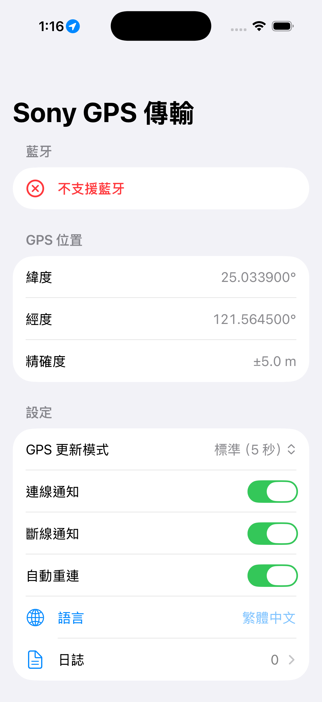
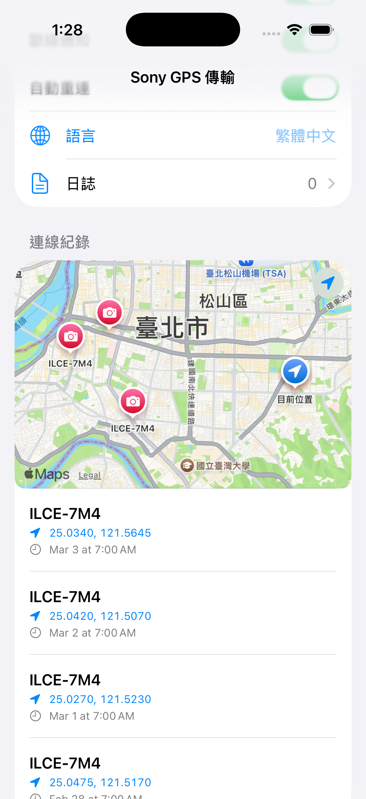

# AlphaLocSnap

## 簡介

由於 Sony 的 Creator's App 太不穩定，常常無法自動連接相機  
AppStore 上的 app 又賣太貴，因此我們團隊決定（90%是claude code)自己做一個出來

## 截圖

  
  

## 下載與安裝

### 直接下載

### iOS 安裝 (選其一)

#### iOS 安裝說明

下載 `.ipa` 文件，然後使用 [AltStore](https://altstore.io)、[SideStore](https://sidestore.io) 或 SideLoadly 來簽名安裝。

也可以透過加入 AltStore 或 SideStore 源來更方便地獲取更新：
- **AltStore 源**: `https://raw.githubusercontent.com/ex7763/AlphaLocSnap/refs/heads/main/altsource/AltSource.json`
- **SideStore 源**: `https://raw.githubusercontent.com/ex7763/AlphaLocSnap/refs/heads/main/altsource/AltSource.json`

## 致謝

Sony Camera 的傳輸協定參考了下面兩個專案  
非常感謝他們的貢獻  
https://github.com/anoulis/sony_camera_bluetooth_external_gps  
https://github.com/Saschl/Alpha-GPS

## Lincense
MIT License
